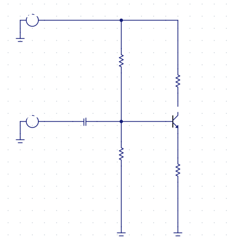
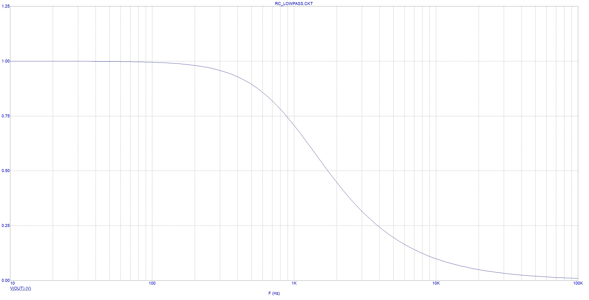
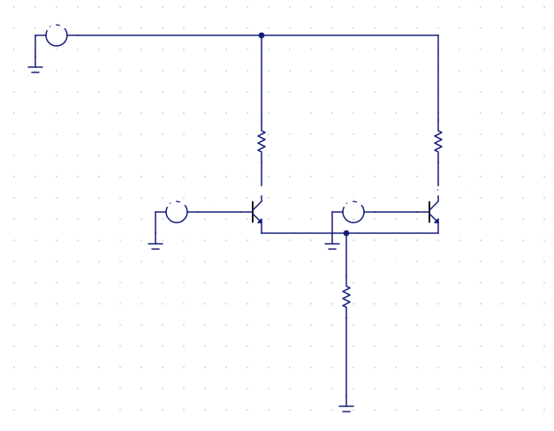
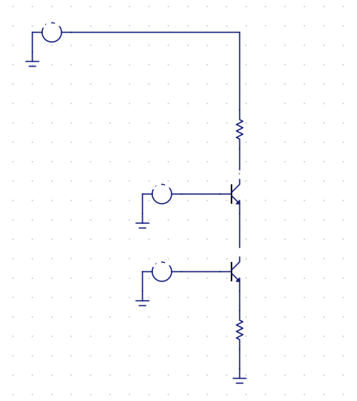
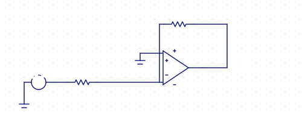

<div align="center">

# microcap-mcp

**An AI agent builds, simulates and draws analog circuits in Micro-Cap 12.**

[](https://github.com/monoxide-xen/microcap-mcp/actions/workflows/tests.yml)
[](LICENSE)
[](https://www.python.org/)
[](#install)
[](https://modelcontextprotocol.io/)

[Русский](README.md) · **English**

 

<sub>The schematic is drawn by the server itself (1:1 with Micro-Cap, operating point overlaid) · the plot is computed by Micro-Cap</sub>

</div>

---

Works through Micro-Cap's own batch mode (`MC12 @batch.bat`) — headless, no GUI automation, no modification of the program.

## What it does

🔧 **Builds circuits from scratch** — 8 stage generators (common-emitter, follower, MOSFET, differential pair, current mirror, cascode, op-amp, RLC) with automatic biasing. Each is checked against theory: gain, operating point, resonance.

📊 **Simulates** — transient / AC / DC / distortion / stability, operating point, sweeps. Complex output as `{re, im}`, solver diagnostics.

🎨 **Draws** — renders a `.CIR` to SVG **1:1 with Micro-Cap**: the native symbols from MC's shape library, the dot grid, every rotation and reflection, the label layout. Overlays operating-point voltages. MC's `/IC` can't export a drawing in batch — this can.

<div align="center">
  
</div>

## Install

```bash
git clone https://github.com/monoxide-xen/microcap-mcp
cd microcap-mcp
uv sync
```

Needs Windows, Python 3.11+ and an installed copy of [Micro-Cap 12](https://spectrum-soft.com/) (freeware). Register it with your MCP client:

```jsonc
{
  "mcpServers": {
    "microcap": {
      "command": "uv",
      "args": ["--directory", "C:/path/to/microcap-mcp", "run", "microcap-mcp"],
      "env": { "MICROCAP_HOME": "E:/Tools/MC12" }   // if the scan misses it
    }
  }
}
```

## Tools

| | |
|---|---|
| `simulate` · `sweep` · `plot` | run a SPICE netlist, sweep a `.DEFINE`, render a JPEG plot |
| `generate_transistor_amplifier` · `_emitter_follower` · `_mosfet_amplifier` | BJT / MOSFET stages, auto-biased to a mid-supply operating point |
| `generate_differential_pair` · `_current_mirror` · `_cascode` · `_amplifier` | differential pair, current mirror, cascode, op-amp amplifier |
| `generate_schematic` | a source + R/C/L in series and parallel (RC/RL/RLC, dividers, tanks) |
| `simulate_schematic` · `plot_schematic` | run / plot an arbitrary `.CIR` |
| `draw_schematic` · `annotate_schematic` | render a `.CIR` to SVG (1:1 with MC) · with the operating point on the drawing |
| `simulate_example` · `search_examples` · `get_example` · `describe_example` · `list_domains` | the ~490 reference circuits shipped with MC: search, source, analyses |

Plus **resources** `microcap://guide` and `microcap://domains` and an `analyse_circuit` **prompt** — so the agent doesn't let Micro-Cap silently mislead it.

## Tests

```bash
uv run pytest        # 138 unit with no Micro-Cap; +30 integration against physics (needs MC)
```

Without Micro-Cap the integration tests skip, so CI stays green.

## How it works

- [Micro-Cap notes](docs/micro-cap-notes.en.md) — behaviour that is not in the manual, and in places contradicts it.
- `eval/harness.py` — runs all ~490 shipped circuits and buckets the failures by cause (88% answer today).

## Licence

[MIT](LICENSE) for the code in this repository. Micro-Cap 12 belongs to Spectrum Software — not included, redistributed or modified: this uses its documented CLI.
